# compare-mcp

[](LICENSE)
[](https://python.org)
[](https://modelcontextprotocol.io)
[](https://claude.ai/code)
[](https://platform.openai.com)
[](https://platform.moonshot.ai)
[](https://platform.minimax.io)

Multi-model code review with ranked todos and subagent dispatch, inside Claude Code CLI.

Claude Code is great at code review — but it only talks to one model. Copilot CLI recently shipped multi-model debug, letting you bounce a problem off GPT, Claude, and Gemini in one shot. Claude Code can't do that natively. This MCP server adds it: bring your own API keys, fan out to any combination of models, and get back a diffed, ranked list of what they each found.

Fan out any bug or task to multiple LLMs simultaneously, diff their unique insights, optionally run a debate round where models critique each other, then dispatch parallel subagents to implement the combined best fixes — each with its own git commit.

## Demo

https://github.com/user-attachments/assets/8990dabb-bc61-4625-8930-c914cffe75da

> `/compare models` → `/compare review config.py for security issues` → `/compare --debate` → `/compare status`

## Architecture

<p align="center">
  
</p>

## Install

```bash
pip install compare-mcp
claude mcp add -s user compare-mcp -- python -m compare_mcp
```

Then grab the `/compare` skill and example config:

```bash
git clone https://github.com/carolinacherry/compare-mcp.git --depth 1
mkdir -p ~/.claude/skills ~/.compare
cp -r compare-mcp/.claude/skills/compare ~/.claude/skills/
cp compare-mcp/.compare/config.example.json ~/.compare/config.json
```

## Quick start

1. Edit `~/.compare/config.json` — enable at least 2 providers by setting `"enabled": true` and adding your API key (either as a `$ENV_VAR` reference or paste the key directly)

2. In Claude Code:
   ```
   /compare memory leak in the tile rendering loop
   /compare race condition in the connection pool --debate --providers claude,openai
   /compare status
   /compare models
   ```

## Config reference

Config lives at `~/.compare/config.json`. API keys use `$ENV_VAR` syntax — expanded at load time.

### Provider types

| Type | SDK | Use for |
|------|-----|---------|
| `anthropic` | anthropic-python | Claude models directly |
| `openai_compat` | openai-python with custom `base_url` | OpenAI, Kimi, Minimax, Gemini, Ollama API, any compatible endpoint |
| `cli` | subprocess stdin/stdout | Ollama CLI, Codex CLI, any binary |

### Compare settings

| Key | Default | Description |
|-----|---------|-------------|
| `max_tokens` | 2048 | Max tokens per provider response |
| `timeout_seconds` | 120 | Per-provider timeout (see note below) |
| `db_path` | `~/.compare/todos.sqlite` | SQLite todo store location |
| `dedup_threshold` | 0.65 | Fuzzy match threshold (0-1). Higher = stricter |
| `max_file_lines` | 1000 | Warn before sending files larger than this |

**Timeout note:** Some models (e.g. Kimi's `kimi-k2.5`) are significantly slower than GPT-4o on large prompts and will time out at 60s. We default to 120s. If a provider consistently times out, try a faster model variant — for Kimi, `moonshot-v1-auto` is faster than `kimi-k2.5` and auto-selects the right context window.

## Adding providers

### Any OpenAI-compatible endpoint

```json
{
  "my_provider": {
    "enabled": true,
    "type": "openai_compat",
    "api_key": "$MY_API_KEY",
    "model": "model-name",
    "base_url": "https://api.example.com/v1"
  }
}
```

Works with: OpenAI, Kimi (api.moonshot.ai), Minimax (api.minimax.io), Gemini (generativelanguage.googleapis.com/v1beta/openai/), Ollama API (localhost:11434/v1), OpenRouter, Together AI, Groq, etc.

### CLI subprocess model

```json
{
  "ollama_local": {
    "enabled": true,
    "type": "cli",
    "cli_command": "ollama",
    "cli_args": ["run", "codellama"],
    "cli_parser": "text"
  }
}
```

`cli_parser` options: `"text"` (raw stdout), `"json"` (parse as JSON), `"jsonl"` (last complete JSON line).

## Commands

In Claude Code, type any of these:

| Command | What it does |
|---------|-------------|
| `/compare <issue>` | Fan out to all enabled models, diff findings, save ranked todos |
| `/compare <issue> --debate` | Same as above, plus a debate round where models critique each other |
| `/compare <issue> --providers openai,kimi` | Compare specific providers only |
| `/compare models` | Show configured providers and their status |
| `/compare status` | Show all todos grouped by status (pending/in_progress/done) |
| `/compare update <id> <status>` | Change a todo's status |

After `/compare` runs, you'll be asked whether to dispatch subagents to fix the findings in parallel. Each subagent gets one todo, implements the fix, and commits.

## How it works

1. **Dispatch** — `compare_run` fans out the code + issue to all enabled providers via `asyncio.gather`. Providers that timeout or error are excluded, never crash the whole run.

2. **Diff** — `compare_diff` uses rapidfuzz (token sort ratio) to deduplicate findings across providers. Findings seen by 2+ providers are "shared"; the rest are "unique". Agreement rate = shared / total unique groups.

3. **Debate** (optional) — `compare_debate` sends each provider's findings to every other provider for critique. A synthesis call merges the results. Capped at 4 providers to limit API calls (N*(N-1)+1).

4. **Todos** — `compare_todos` writes ranked findings to SQLite. High severity first, then by provider count.

5. **Execute** — The `/compare` skill dispatches parallel Claude Code subagents, one per todo. Each implements the fix and commits.

## MCP tools (7)

| Tool | Description |
|------|-------------|
| `compare_models` | List configured providers (no API keys exposed) |
| `compare_run` | Fan out code review to providers in parallel |
| `compare_diff` | Extract unique vs shared insights with fuzzy dedup |
| `compare_debate` | Models critique each other, then synthesize |
| `compare_todos` | Write ranked findings to SQLite |
| `compare_status` | Read todos grouped by status |
| `compare_todo_update` | Update a todo's status |

## vs multi_mcp

[multi_mcp](https://github.com/religa/multi_mcp) does parallel dispatch well. compare-mcp builds the workflow layer on top:

| Feature | multi_mcp | compare-mcp |
|---------|-----------|-------------|
| Parallel dispatch | yes | yes |
| OpenAI-compat providers | yes | yes |
| CLI subprocess models | yes | yes |
| Debate / critique round | raw | structured + merged output |
| **Insight diff (unique vs shared)** | no | rapidfuzz dedup |
| **Agreement rate metric** | no | yes |
| **SQLite ranked todo store** | no | yes |
| **Subagent dispatch per todo** | no | yes |
| **Git commit per fix** | no | yes |
| **CC skill + /compare** | no | yes |
| **pip install** | no (git clone + make) | yes |

## vs Copilot CLI multi-model

Copilot CLI routes through GitHub's API proxy — no BYO keys, no Kimi/Minimax/local models. compare-mcp calls provider APIs directly: full context windows, your own rate limits, any model with an HTTP endpoint or CLI binary.

## Development

```bash
git clone https://github.com/carolinacherry/compare-mcp.git
cd compare-mcp
pip install -e ".[dev]"
pytest
ruff check .
```
